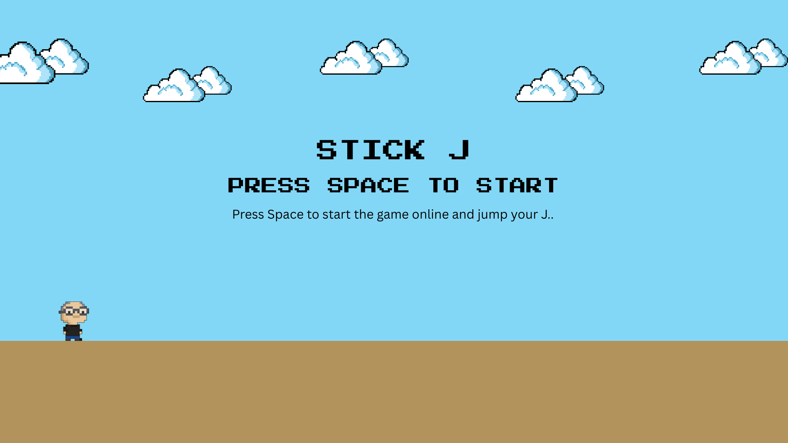
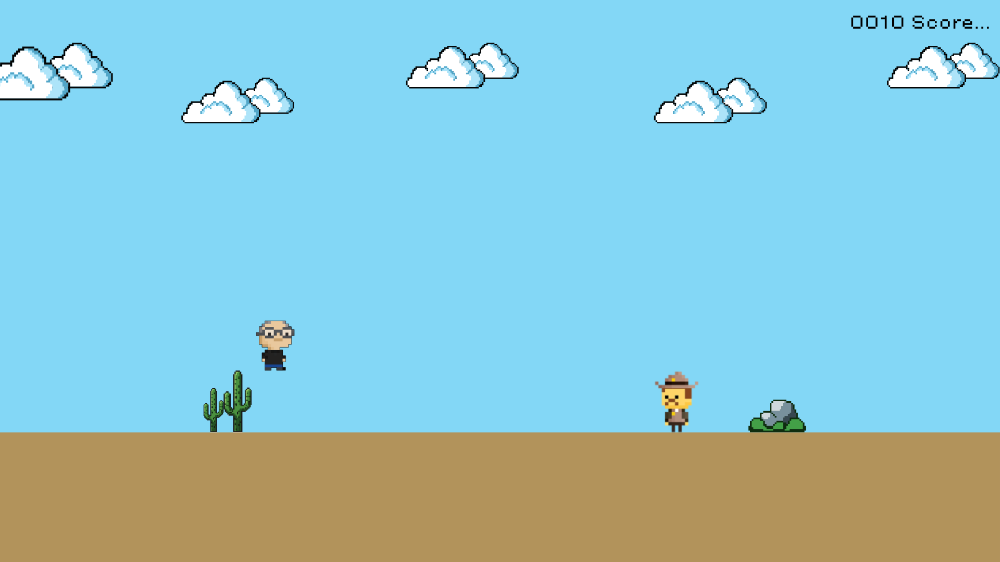
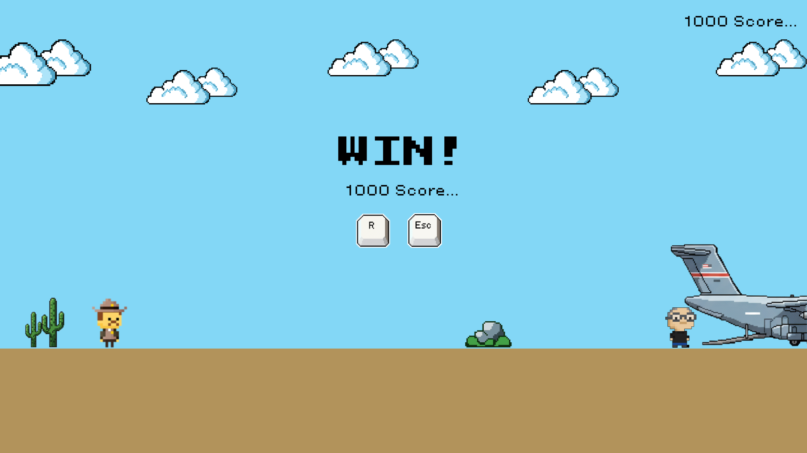
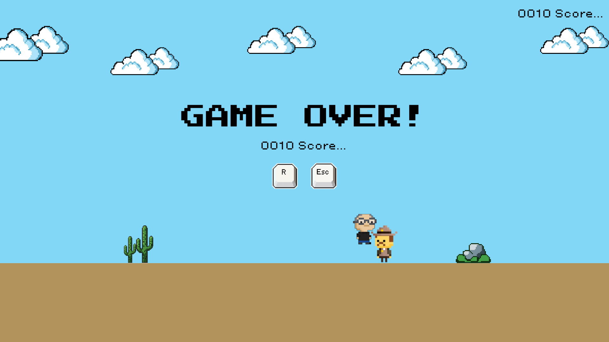

# SECJ1023-PT2-PROJECT-STICKJ: Official Repo

---

# 🕹️ Stick J – 2D Platformer (C++ & WinBGIm)

**Stick J** is a simple 2D platformer game built using **C++** and the **WinBGIm graphics library**.
The game is designed as a lightweight, beginner-friendly project to practice fundamental programming concepts such as object-oriented design, game loops, collision detection, and sprite rendering.

This project demonstrates how a basic game can be constructed using only the standard C++ language and a legacy graphics library, without relying on modern engines.

---

## 🎨 Game Design 🖼

|  |
|:--:|
| *Design 1: Game Opening Screen* |

|  |
|:--:|
| *Design 2: Gameplay Screen* |

|  |
|:--:|
| *Design 3: WIN Screen* |

|  |
|:--:|
| *Design 4: GAME OVER Screen* |

---

## 🎮 Game Features

* **Classic platformer movement**
  Move left and right, jump, and navigate through obstacles.

* **Player vs. Enemy Interaction**
  Basic enemy AI that patrols and chases the player when nearby.

* **Obstacles & Platforms**
  Static objects the player must avoid or use to progress.

* **Score System**
  Earn points by surviving, avoiding obstacles, or defeating enemies.

* **Start Screen & Game Over Screen**
  Simple user interface with instructions and visuals.

---

## 🧱 Technologies Used

* **C++** (core programming)
* **WinBGIm / graphics.h** (2D drawing and rendering)
* **MinGW + Code::Blocks** (recommended compiler + IDE)

This project focuses on manual rendering and logic instead of using a full game engine, making it a good learning project for programming fundamentals.

---

## 🗂️ Project Structure

* `main.cpp` – game loop and window initialization
* `player.cpp / player.h` – player movement, physics, and drawing
* `guard.cpp / guard.h` – enemy behavior and patrol logic
* `obstacle.cpp / bstacle.h` – platforms and collision logic
* `score.cpp / score.h` – scoring system
* `background.cpp / background.h` – background drawing

(Easily expandable for more levels or features.)

---

## 🏆 Learning Outcomes

This project helped explore:

* How 2D graphics are drawn using WinBGIm
* Handling input (keyboard events)
* Collision detection
* Updating and rendering game objects
* Object-oriented programming in game development
* Basic animation using sprite sheets or bitmap images

---

## 📌 Notes

This project uses the **WinBGIm graphics library**, which is outdated but commonly used in introductory C++ courses. It is recommended to run with **MinGW (32-bit)** but it's been upgraded to support **(64-bit)** architecture also **Code::Blocks** for best compatibility.

---

## Setup Requirements

* MinGW (64-bit) Supports: [Link 1](https://github.com/ahmedshakill/WinBGIm-64) (Recommended) or [Link 2](https://drive.google.com/drive/folders/1hsbHGB8H8NOC4hiOZ26nD5qGelfc95An?usp=sharing)

---

## Setup Steps

1. Download the MinGW (64-bit) files, extract them, open it and locate to this directory `WinBGIm-64-1.0.1\libbgi\include\bgi`, you will see 5 header files. Copy and paste them to your C++ default library.
   
   - Example for various C++ installers default library directory:
     * **(MinGW with Msys64)** Paste it in `C:\msys64\ucrt64\include`

---
